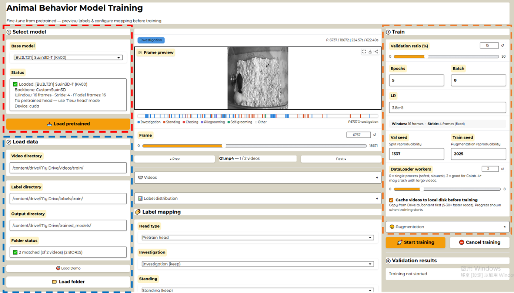
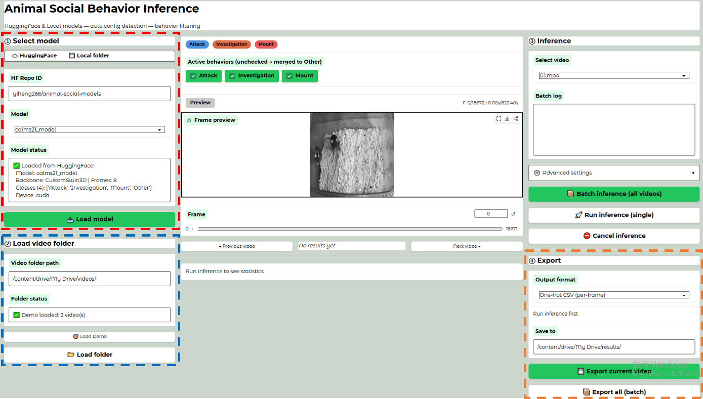

<div align="center">

# CREAC

### Cross-species Retrainable Animal Behavior Classifier

Point-and-click video-transformer tools for training animal-behavior classifiers and running frame-level inference — no pose estimation and no programming required.

<p>
  <a href="https://colab.research.google.com/github/yiheng226/CREAC/blob/main/inference.ipynb"></a>
  <a href="https://colab.research.google.com/github/yiheng226/CREAC/blob/main/training.ipynb"></a>
  <a href="https://huggingface.co/yiheng266/animal-social-models"></a>
  <a href="LICENSE"></a>
  
</p>

</div>

CREAC fine-tunes Kinetics-400-pretrained Video Swin-T and TimeSformer backbones on your own animal videos. Its browser-based Google Colab interfaces cover model selection, video and label preview, behavior mapping, training, validation, inference, ethograms, and CSV/BORIS export.

## Interface Preview

<table>
  <tr>
    <td width="50%" align="center">
      <a href="docs/images/training_gui.png"></a>
      <br><strong>Training GUI</strong><br>
      Preview labels, configure behavior mapping, train, and inspect validation results.
    </td>
    <td width="50%" align="center">
      <a href="docs/images/inference_gui.png"></a>
      <br><strong>Inference GUI</strong><br>
      Load a model, preview videos, run single or batch inference, and export results.
    </td>
  </tr>
</table>

Click either screenshot to view it at full resolution.

## Three-Minute Setup

> **Recommended hardware:** Google Colab with an **NVIDIA L4 GPU**. In Colab, open **Runtime → Change runtime type → L4 GPU** when it is available. Other CUDA GPUs can work, but training speed and memory capacity will differ; L4 availability depends on your Colab plan and quota.

### Run inference on your videos

1. [Open `inference.ipynb` in Google Colab](https://colab.research.google.com/github/yiheng226/CREAC/blob/main/inference.ipynb).
2. Run the setup cell and mount Google Drive.
3. Select a pretrained Hugging Face model or a local checkpoint folder.
4. Choose the Google Drive folder containing your videos.
5. Run single-video or batch inference, then export a per-frame CSV or BORIS event log.

### Train on your own labels

1. [Open `training.ipynb` in Google Colab](https://colab.research.google.com/github/yiheng226/CREAC/blob/main/training.ipynb).
2. Run the setup cell, mount Google Drive, and select a pretrained backbone or model.
3. Choose the Drive folders containing the training videos, labels, and model outputs.
4. Preview the annotation timeline, then keep, merge, or exclude each behavior label.
5. Set the validation split and training options, start training, and use the saved checkpoint/config in the inference notebook.

The setup takes only a few minutes; model download, training, and inference time depend on the GPU and the size of your videos.

## Models and Datasets

All released **pretrained weights, config files, demo videos, lab videos, annotations, and paper-reproduction checkpoints** are hosted in one place:

### [Hugging Face — `yiheng266/animal-social-models`](https://huggingface.co/yiheng266/animal-social-models)

The inference GUI reads each model's `config.json` automatically, so its backbone, temporal settings, and class names stay paired with the correct `model.pth` weights.

### Ready-to-use pretrained models

| Model | Dataset/species | Backbone | Behavior classes | Input |
|---|---|---|---|---|
| [`calms21_model`](https://huggingface.co/yiheng266/animal-social-models/tree/main/calms21_model) | CalMS21 mouse | Video Swin-T | Attack, Investigation, Mount, Other | 8 × 224 × 224 |
| [`crim13_model`](https://huggingface.co/yiheng266/animal-social-models/tree/main/crim13_model) | CRIM13 mouse | Video Swin-T | 13 CRIM13 classes | 8 × 224 × 224 |
| [`mice_lab_model`](https://huggingface.co/yiheng266/animal-social-models/tree/main/mice_lab_model) | Lab mouse | Video Swin-T | Aggression, Investigation, Allo-groom, Standing, Other | 8 × 224 × 224 |
| [`flyvsfly_model`](https://huggingface.co/yiheng266/animal-social-models/tree/main/flyvsfly_model) | Drosophila | TimeSformer ViT-Base | wing_extension, circle, copulation, others | 8 × 224 × 224 |

### Data and reproduction assets

| Resource | Hugging Face location | Contents |
|---|---|---|
| Quick demo | [`demo/`](https://huggingface.co/yiheng266/animal-social-models/tree/main/demo) | Two mouse videos with matching frame-level CSV labels |
| Videos and annotations | [`videos for reproduce/`](https://huggingface.co/yiheng266/animal-social-models/tree/main/videos%20for%20reproduce) | Lab mouse, lab Drosophila, cross-domain mouse, and open Drosophila videos/labels |
| Paper checkpoints | [`models for reproduce/`](https://huggingface.co/yiheng266/animal-social-models/tree/main/models%20for%20reproduce) | Checkpoints organized by Table/Figure |

## What You Need to Prepare

### Inference

Only a folder of videos (`.mp4`, `.avi`, and other Decord-readable formats) is required. Select a released Hugging Face model or your own trained model folder, then point the notebook to the video directory.

### Training

Training requires videos plus frame-level annotations:

- A **video folder** containing one file per recording.
- A **label folder** containing one annotation file per video, in either format:
  - **BORIS event logs** exported from [BORIS](https://www.boris.unito.it/), or
  - **one-hot CSV files** with one row per frame and one column per behavior (`1` = active).
- Matching base filenames, for example `mouse01.mp4` ↔ `mouse01.csv`.

```text
my_dataset/
├── videos/
│   ├── mouse01.mp4
│   └── mouse02.mp4
└── labels/
    ├── mouse01.csv
    └── mouse02.csv
```

Use the Hugging Face [`demo/`](https://huggingface.co/yiheng266/animal-social-models/tree/main/demo) files as a concrete video/label example.

## Inputs and Outputs

| Workflow | Input | Output |
|---|---|---|
| Inference | Videos + a checkpoint/config | Frame predictions, live ethogram/statistics, one-hot CSV, or BORIS event log |
| Training | Videos + frame labels + a base model | `.pth` checkpoint, paired config, training log, metrics, and validation views |

## How the Notebooks Work

**Inference:** select a Hugging Face or local model → load a video folder → preview and filter behaviors → run single or batch inference → inspect frame predictions, ethogram, and behavior statistics → export CSV or BORIS results.

**Training:** select a pretrained backbone/model → load videos and labels → preview the annotation timeline → map labels onto training classes → configure the validation split and hyperparameters → train with live F1/mAP → review per-epoch, threshold, and ethogram validation views → save the checkpoint and config.

## Repository Structure

| Path | Purpose |
|---|---|
| [`training.ipynb`](training.ipynb) | Point-and-click model training in Colab |
| [`inference.ipynb`](inference.ipynb) | Point-and-click inference and export in Colab |
| `gui_training.py`, `gui_inference.py` | Notebook GUI implementations |
| `models.py`, `inference.py`, `training_utils.py`, `config_utils.py` | Core model, inference, training, and config utilities |
| [`reproduce/`](reproduce/) | Training/evaluation scripts and plotted-data CSVs for every paper result |
| [`docs/images/`](docs/images/) | README screenshots |

## Paper and Reproducibility

The CREAC manuscript is currently **under review**. A formal paper link and citation will be added when they become publicly available.

The [`reproduce/`](reproduce/) directory is organized by the corresponding paper table or figure. Each folder contains a dedicated README, complete training/evaluation commands, scripts, and the CSV data used for the reported plots.

| Paper result | Folder | Experiment |
|---|---|---|
| Table 1 | [`reproduce/table1/`](reproduce/table1/) | Video Swin-T versus TimeSformer on lab mouse behavior |
| Table 2 | [`reproduce/table2/`](reproduce/table2/) | CalMS21 and CRIM13 public benchmarks |
| Table 3 | [`reproduce/table3/`](reproduce/table3/) | Video Swin-T versus TimeSformer on lab Drosophila behavior |
| Figure 4 | [`reproduce/figure4/`](reproduce/figure4/) | Mouse video-level data efficiency |
| Figure 5 | [`reproduce/figure5/`](reproduce/figure5/) | Drosophila video-level data efficiency |
| Figure 6 | [`reproduce/figure6/`](reproduce/figure6/) | Cross-domain mouse transfer |
| Figure 7 | [`reproduce/figure7/`](reproduce/figure7/) | Open-to-lab Drosophila transfer |

> **Exact-number reproducibility:** GPU nondeterminism, mixed-precision training, and multi-worker loading can produce small differences even with fixed seeds. Use the released Hugging Face checkpoints to reproduce the reported numbers exactly.

The graphical notebooks are intended for prospective use—training new models and classifying new videos. The standalone scripts in `reproduce/` reproduce the manuscript experiments.

## License

Released under the [MIT License](LICENSE).
